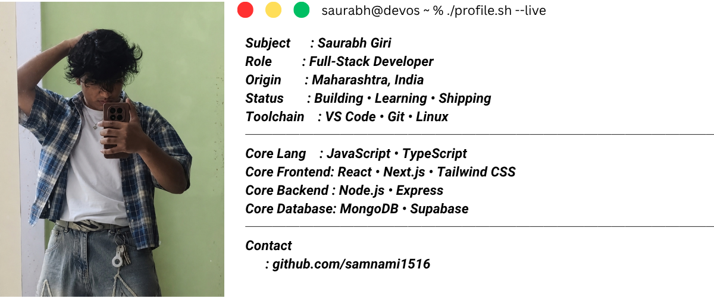

<div align="center">
  
</div>


# Hi there, I'm Saurabh 👋
```bash
# System Profile
Role        : Full-Stack Web Developer & Tech Explorer
Tech Stack  : JavaScript, React.js, Node.js, Express, MongoDB
Tools       : VS Code, Git, Linux
Status      : Building scalable web applications & exploring new tech

```
### 🛠️ Tech Stack


### 📊 GitHub Stats
<div align="center">
  
</div>
<div align="center">
  
</div>
